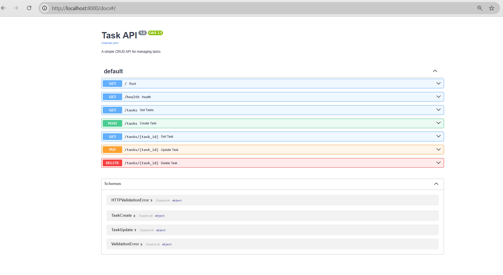

# Task API - FlyRank Backend Week 2

A simple CRUD API built using FastAPI for managing a task list.

## How to Install and Run

### 1. Clone the repository

```bash
git clone YOUR_GITHUB_REPOSITORY_URL
```

### 2. Navigate into the project

```bash
cd flyrank-task-api
```

### 3. Create virtual environment

```bash
python -m venv venv
```

### 4. Activate virtual environment

Windows:

```bash
.\venv\Scripts\activate
```

### 5. Install dependencies

```bash
pip install -r requirements.txt
```

### 6. Run the API

```bash
uvicorn main:app --reload
```

The API will be available at:

```
http://localhost:8000
```

---

# Swagger UI

FastAPI provides Swagger documentation automatically.

Open:

```
http://localhost:8000/docs
```



---

# API Endpoints

| Method | Endpoint | Description |
|---|---|---|
| GET | `/` | API information |
| GET | `/health` | Health check |
| GET | `/tasks` | Get all tasks |
| GET | `/tasks/{id}` | Get one task |
| POST | `/tasks` | Create a task |
| PUT | `/tasks/{id}` | Update a task |
| DELETE | `/tasks/{id}` | Delete a task |

---

# Example POST Request

Endpoint:

```
POST /tasks
```

Request body:

```json
{
    "title": "Complete FlyRank assignment"
}
```

Response:

```json
{
    "id": 4,
    "title": "Complete FlyRank assignment",
    "done": false
}
```

---

# Curl Test Example

Command:

```bash
curl -i http://localhost:8000/tasks
```

Response:

```
HTTP/1.1 200 OK
```

---

# Notes

This API uses in-memory storage.

Tasks will reset when the server restarts because no database is used.